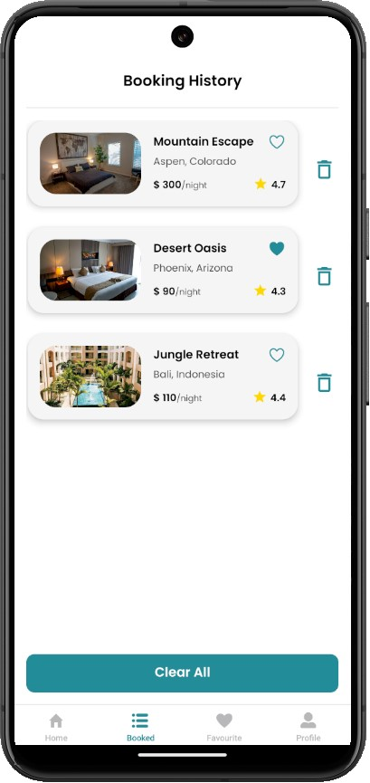
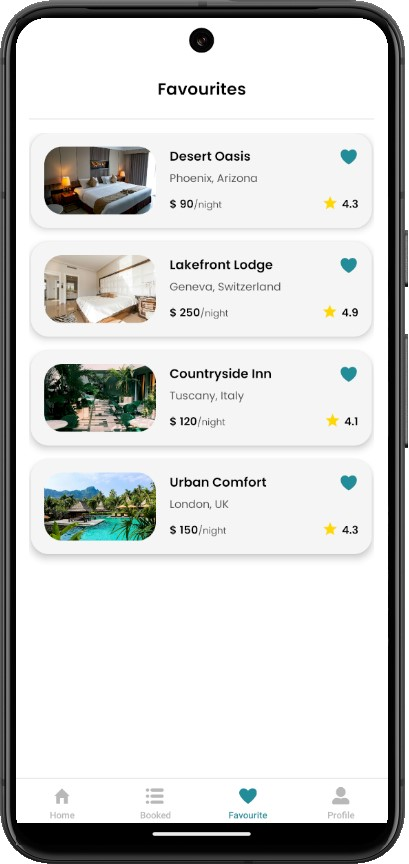

# Hotel Booking App

<div style="display: flex; justify-content: space-between; flex-wrap: wrap;">
  
  
  
  
  
  
  
  
  
  
  
 
</div>
<br/>

## Overview 🏨

The **Hotel Booking App** is a mobile application designed to facilitate the booking of hotels for users based on categories such as price range, location, and type of accommodation. The app allows users to browse hotels, view their details, and make bookings, providing a seamless experience for hotel booking through a user-friendly interface.

This app is built with React Native and utilizes modern tools for efficient management of data and state. The backend integrates with Firebase for authentication and storage, ensuring users' data is securely stored. The app is designed to be responsive and works smoothly across different devices.

---

## Features 🎯

- **Browse Hotels**: View a list of hotels categorized by location, price, and more.
- **Hotel Details**: View detailed information for each hotel, including photos, amenities, and descriptions.
- **Booking History**: Users can track their past bookings.
- **Clear Bookings**: Users can clear their booking history when needed.
- **Category-Based Navigation**: Navigate through hotel categories like budget, luxury, etc.
- **Dynamic Navigation**: App dynamically adjusts the header based on the category of hotels being viewed.

---

## Technologies Used ⚙️

The project leverages the following technologies:

### 1. **React Native** 📱

A framework for building native apps using React. This app is built using React Native, which allows us to use the same codebase for both iOS and Android apps.

### 2. **React Navigation** 🧭

Used for navigation between different screens within the app. This app uses **Stack Navigation** and **Bottom Tab Navigation** for smooth transitions between various app pages, such as the Home, List of Hotels, and Booking History screens.

### 3. **Redux** 🛠️

State management is handled with **Redux**, ensuring that the app can manage and update the state efficiently, especially for user authentication and booking data.

### 4. **Firebase** 🔥

Firebase is used for handling user authentication (using Firebase Authentication) and storing user-related data such as bookings (using Firebase Firestore).

### 5. **AsyncStorage** 📦

Used for storing user data locally on the device, such as previous bookings. This allows the app to retain the booking history even when the app is closed or restarted.

## User Instructions 📖

Here’s how the app can be used by end-users:

### 1. **Browse Hotels**

- Open the app and browse through different hotel categories.
- Tap on a category to view the hotels in that category.

### 2. **View Hotel Details**

- Once a hotel is selected, users can view more details such as images, amenities, and a detailed description.

### 3. **Make a Booking**

- Select a hotel and follow the prompts to book it.
- After booking, you can view your past bookings in the booking history section.

### 4. **Booking History**

- Users can see a list of previous bookings.
- Users can also clear their booking history if needed.

---

## Technical Documentation 💻

This section explains how to run the project locally for development or deployment purposes.

### 1. **Requirements**

- Node.js (LTS version recommended)
- React Native CLI (for iOS or Android development)
- Expo or Android Studio/ Xcode for building the app.

### 2. **Setting up the Project Locally**

#### Clone the Repository

First, clone this repository to your local machine:

```bash
git clone https://github.com/yourusername/hotel-booking-app.git
```

#### Install Dependencies

Navigate to the project directory and install the required dependencies:

```bash
cd Mobile_Hotel_Management
npm install
```

#### Running the App

- For **Android:**

```bash
npx react-native run-android
```

- For **iOS:**

```bash
npx react-native run-ios
```
